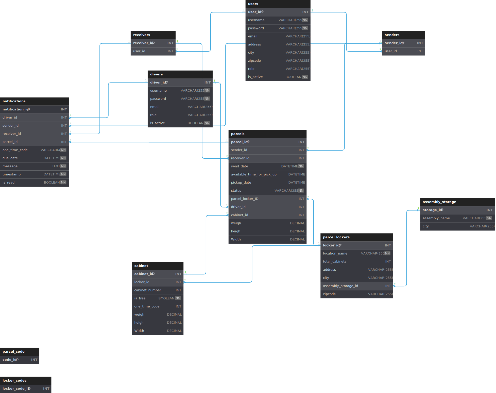

<h1 align = "center"> APost </h1>
<div align = "center">

[](https://opensource.org/licenses/MIT)

</div>
<p align = "center">Postal Service Web app. Simple parcel management, check, send, and receive parcels without any problems  </p>
<div align = "center">

Demo versions:
[Customer App](https://just-apost.web.app/) |
[Driver App](https://just-apost-drivers.web.app/) |
[Locker App](https://just-apost-locker.web.app/)

</div>


## Table of contents
  1. <a href="#features">Features</a> 
  2. <a href="#Technologies">Technologies</a> 
  3. <a href="#prerequisites">Prerequisites</a> 
  4. <a href="#installation">Installation</a> 
  5. <a href="#usage">Usage</a> 
  6. <a href="#how-it-works">How it works</a>
  7. <a href="#app-architecture">App Architecture</a> 
  8. <a href="#db-structure">DB Structure</a> 
  9. <a href="#contributing">Contributing</a>
  10. <a href="#License">License</a>


## Features
-  User authorization and authentication (JWT)
-  User account creation, deactivation, and management
-  Responsive design
-  General Parcels view
-  Parcel Details view
-  Parcel sorting (by type)
-  In app notifications
-  Email notifications
-  Driver app
-  Locker machine app
-  Parcel generator robot 


## Technologies
- Java (spring boot)
- PostgreSQL
- ReactJS
- CSS


## Prerequisites
- Node.js 
- Java
- Spring boot
- PostgresSQL


## Installation
1. Clone the repo
```sh
git clone https://github.com/OAMK-VPN/APost.git
```
2. Go to the client directory and install dependencies `(npm i / pnpm i)`
```sh
cd client/customer
cd client/driver
cd client/locker
npm install / pnpm install
```
3. Update Endpoints in `.env` (if needed)
```sh
VITE_APP_USERS_BASEURL=
VITE_APP_PARCELS_BASEURL=
VITE_APP_NOTIFICATIONS_BASEURL=
```
4. Update properties in application.properties `(server/src/main/resources/)`


## Usage
1. Run the server
```sh
cd server
mvn spring-boot:run
```
2. Run the client
```sh
cd client/customer
cd client/driver
cd client/locker
npm run dev
```


## How it works
<div align="center">

  

</div>


## App architecture
<div align = "center">

  

</div>


## DB structure
<div align="center">
  
  

</div>


## License
This project is licensed under a [MIT license](https://opensource.org/licenses/MIT)
